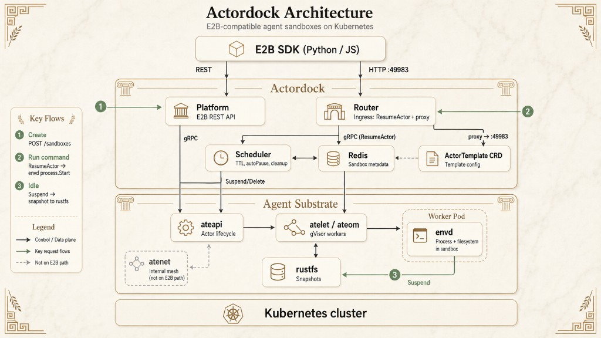

# actordock

**Hundreds of agent sandboxes. A handful of Pods.** Actordock ships Agent Substrate worker multiplexing behind an E2B-compatible API—gVisor isolation, sub-second suspend/resume, RAM and filesystem snapshots on idle, 30×+ session oversubscription on warm Workers. Point the E2B SDK at your cluster; no code changes.

Self-hosted. Kubernetes-native. One command to deploy.

```bash
./hack/install-local.sh
./hack/verify-local.sh
```

See [Quickstart](docs/user/quickstart.md) for prerequisites, env vars, and troubleshooting.

## Architecture

E2B-compatible agent sandboxes on Kubernetes: SDK REST/HTTP through Actordock (Platform, Router, Scheduler, Redis), execution on Agent Substrate (ateapi, atelet/ateom, envd).



Details: [Architecture](docs/architecture.md) · [Roadmap](docs/roadmap.md)
