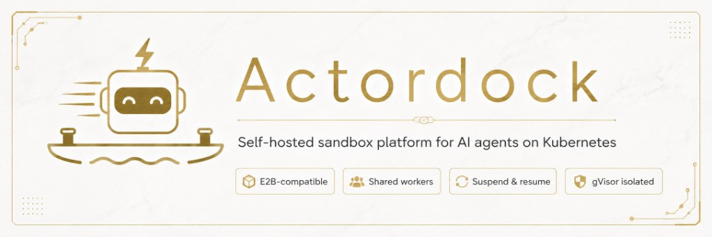

<p align="center">
  
</p>

# actordock

**Hundreds of Agents. A handful of sandbox Pods.** Actordock multiplexes agent sandboxes behind an E2B-compatible API—gVisor isolation, sub-second suspend/resume, RAM and filesystem snapshots on idle, 30×+ session oversubscription on warm Workers. Point the E2B SDK at your cluster; no code changes.

Self-hosted. Kubernetes-native. One command to deploy.

```bash
./hack/install-local.sh
./hack/verify-local.sh
```

See [Quickstart](docs/user/quickstart.md) for prerequisites, env vars, and troubleshooting.

## Architecture

E2B-compatible agent sandboxes on Kubernetes: SDK REST/HTTP through Actordock (Platform, Router, Scheduler, Redis), execution on the vendored `runtime/` tree (runtime-api, runtime-worker, envd, snapshots).


**Flows:** Create (solid) — SDK → Platform → runtime-api → worker + envd → Redis. Command/Resume (dashed) — SDK → Router → runtime-api → envd. Lifecycle (dotted) — Scheduler → runtime-api suspend → snapshot.

Details: [Architecture](docs/architecture.md) · [Roadmap](docs/roadmap.md)
