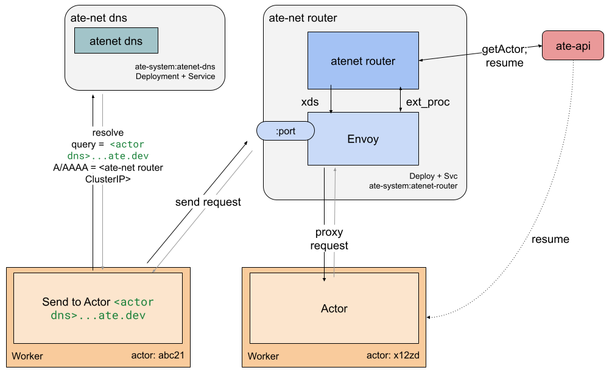

# runtime-net

runtime-net is a combined daemon for all networking functionality.

* DNS server for runtime Actor resolution: `runtime-net dns`
* Lightweight mTLS proxy sidecar for demonstrating using runtime identities. `runtime-net sidecar`
* Envoy control plane for programming runtime resolution. `runtime-net router`

This is built as a single binary for convenience in the prototyping.

## Cluster deployment

### router

(Note: this deployment model combines Envoy dataplane with the router. This will
likely be split in the future for better scalability.)

* `runtime-net router` will be deployed as Deployment and Service
* Deployment will contain:
  * Envoy
  * runtime-net router
* Service will expose:
  * Envoy port 80 and 443.

RBAC permissions:
* read, list on ActorTemplate

### dns

* `runtime-net dns` will be deployed as:
  * Deployment
  * Service exposing tcp and udp 53

* read, list on kube-system services
* read, list on actordock-system services

## testing

Run the package tests with `go test ./cmd/runtime-net/...`.
